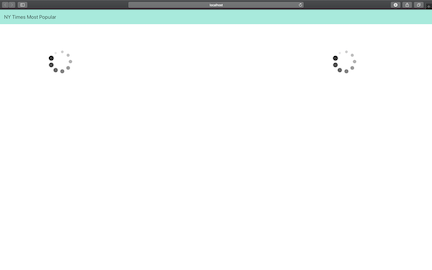
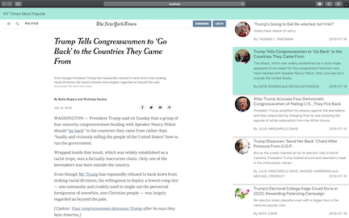
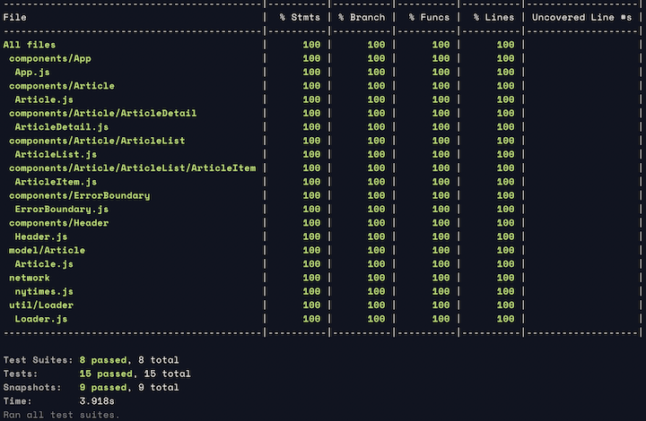

# nytimes-mostpopular
[The New York Times](http://nytimes.com) reader web app, made with [React.js](https://reactjs.org/).

## App Preview




## Features / Components
- Uses `React ^16.8.6`
- Reader for most popular articles from [NY Times APIs](http://api.nytimes.com) 
- Uses [React Bootstrap](https://react-bootstrap.github.io/getting-started/introduction) for UI components
- `iframe` to render article details page

## Development

### Getting started
Once you clone (or download) this repository, do below 
```$xslt
$ cd nytimes-mostpopular
$ npm install 
```

### App Configuration
Configurations specific to the NYTimes APIs resides in [.env.js](src/.env.js). Usage
- `NYTIMES_API_KEY`: API access key for NYTimes APIs.
- `PERIOD`: Number of days, articles are to be loaded for.


### Scripts
- `$ npm start` - Runs the app in the development mode.
                  Open http://localhost:3000 to view it in the browser.
- `$ npm test` - Executes tests and prepares code coverage report


## Testing
The project currently contains unit-tests for the components, at same path with name suffixed `.test.js`.
In order to execute these tests, run `npm test`.


### Current Test Coverage


Open [coverage/lcov-report/index.html](coverage/lcov-report/index.html) in browser for details.


## References
- [Dev Portal - The New York Times](https://developer.nytimes.com)
